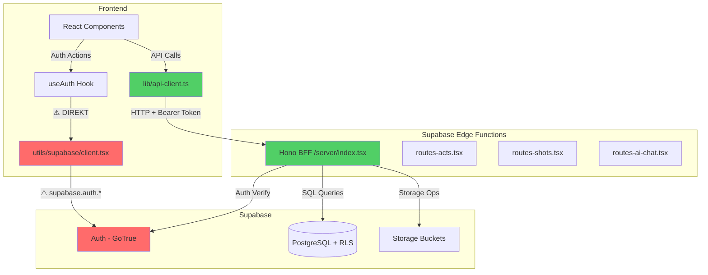

# Scriptony Adapter Audit Report
**Datum:** 2025-01-23  
**Projekt:** Scriptony  
**Zweck:** Analyse der Supabase-Kopplung und Adapter-Architektur

---

## 1. Executive Summary

**Kurzfazit:** Hybride Architektur mit BFF-Layer vorhanden, aber **direkte Auth-Kopplung** im Frontend.

- ✅ **DB:** Vollständig entkoppelt über Backend (Supabase Edge Functions)
- ⚠️ **Auth:** Direkte Kopplung an Supabase GoTrue im Frontend (4/5)
- ✅ **Storage:** Über Backend-Proxy, aber Auth-Token direkt geholt
- ✅ **Realtime:** Nicht verwendet
- ✅ **Edge Functions:** Clean HTTP-Schnittstelle über `/lib/api-client.ts`

**Gesamtscore:** **2.0/5** (mäßig gekoppelt)

Die Hauptkopplung ist Auth – Frontend verwendet `supabase.auth.*` direkt. Alle DB-Operationen laufen über BFF. Eine vollständige Provider-Migration würde primär das Auth-System betreffen (z.B. Auth0, Clerk, Cognito).

---

## 2. Struktur-Check (API/BFF/Adapter)

### ✅ BFF/Backend vorhanden
- **Location:** `/supabase/functions/server/`
- **Framework:** Hono.js (Edge Function)
- **Routes:**
  - `index.tsx` (Main Entry)
  - `routes-acts.tsx`, `routes-sequences.tsx`, `routes-scenes.tsx`, `routes-shots.tsx`
  - `routes-ai-chat.tsx`, `routes-ai-minimal.tsx`
  - `routes-worlds.tsx`, `routes-characters.tsx`, `routes-episodes.tsx`
  - `routes-projects-init.tsx`, `routes-debug.tsx`

### ✅ API-Client-Layer (teilweise)
- **`/lib/api-client.ts`:** Zentraler HTTP-Client mit Auth-Handling
- **`/lib/api/timeline-api.ts`:** Timeline-spezifische API (Acts, Sequences, Scenes)
- **`/lib/api/shots-api.ts`:** Shot-spezifische API (CRUD, Uploads, Characters)
- **`/utils/api.tsx`:** Legacy Wrapper (deprecated, zeigt auf `api-client`)
- **`/utils/storage.tsx`:** Storage Upload Wrapper (ruft Backend `/storage/upload` auf)

### ⚠️ Fehlende Adapter/Ports
- **Kein `AuthClient` Interface:** Auth direkt über `supabase.auth.*`
- **Kein `DbClient` Interface:** Aber nicht nötig, da DB nur im Backend
- **Kein `StorageClient` Interface:** Aber Backend-Proxy vorhanden

### 📂 BFF-Struktur
```
/supabase/functions/server/
├── index.tsx                   # Main Entry + Organization Logic
├── kv_store.tsx                # KV-Store Utility (protected)
├── routes-acts.tsx             # Acts CRUD + Reorder
├── routes-sequences.tsx        # Sequences CRUD + Reorder
├── routes-scenes.tsx           # Scenes CRUD + Reorder
├── routes-shots.tsx            # Shots CRUD + Storage + Characters
├── routes-ai-chat.tsx          # AI Chat + RAG
├── routes-ai-minimal.tsx       # Minimal AI Routes
├── routes-worlds.tsx           # Worldbuilding
├── routes-characters.tsx       # Characters
├── routes-episodes.tsx         # Episodes
├── routes-projects-init.tsx    # Project Initialization
├── routes-debug.tsx            # Debug Routes
├── ai-provider-calls.tsx       # OpenAI, Anthropic, OpenRouter
├── rag-sync-worker.tsx         # RAG Background Worker
├── sql-migration-runner.tsx    # SQL Migration Runner
├── token-counter.tsx           # Token Counter (tiktoken)
├── tools-*.tsx                 # MCP Tools
└── migrate-to-postgres.tsx     # KV→Postgres Migration
```

---

## 3. Direktverwendung von Supabase im Frontend

### 3.1 Auth (⚠️ Direkt gekoppelt)

| Datei | Zeile | Code | Kontext |
|-------|-------|------|---------|
| `/utils/supabase/client.tsx` | 9-19 | `createClient(url, key, { auth: ... })` | Singleton Instance |
| `/hooks/useAuth.tsx` | 38 | `supabase.auth.onAuthStateChange(...)` | Auth State Listener |
| `/hooks/useAuth.tsx` | 76 | `supabase.auth.getSession()` | Session Check |
| `/hooks/useAuth.tsx` | 143 | `supabase.auth.signInWithPassword(...)` | Login |
| `/hooks/useAuth.tsx` | 174 | `supabase.auth.signInWithOAuth(...)` | OAuth Login |
| `/hooks/useAuth.tsx` | 198 | `supabase.auth.signOut()` | Logout |
| `/hooks/useAuth.tsx` | 212 | `supabase.auth.updateUser(...)` | Update Profile |
| `/hooks/useAuth.tsx` | 230 | `supabase.auth.resetPasswordForEmail(...)` | Password Reset |
| `/hooks/useAuth.tsx` | 243 | `supabase.auth.updateUser({ password })` | Update Password |
| `/hooks/useAuth.tsx` | 256 | `supabase.auth.getSession()` | Get Access Token |
| `/lib/api-client.ts` | 55 | `supabase.auth.getSession()` | Get Auth Token |
| `/utils/storage.tsx` | 25 | `supabase.auth.getSession()` | Upload Auth |
| `/utils/storage.tsx` | 73 | `supabase.auth.getSession()` | Storage Usage Auth |
| `/App.tsx` | 189, 214 | `supabase.auth.signInWithPassword(...)` | Auto-Login |

**Bewertung:** Alle Auth-Operationen laufen direkt über Supabase GoTrue Client.

### 3.2 DB (✅ Entkoppelt)

**KEINE direkte DB-Verwendung im Frontend!**  
Alle `supabase.from(...)` Aufrufe sind im Backend (`/supabase/functions/server/`).

### 3.3 Storage (✅ Über Backend-Proxy)

| Datei | Zeile | Code | Kontext |
|-------|-------|------|---------|
| `/utils/storage.tsx` | 37 | `fetch('/storage/upload')` | Upload via Backend |
| `/utils/storage.tsx` | 80 | `fetch('/storage/usage')` | Usage via Backend |

**Bewertung:** Storage-Operationen laufen über Backend (`/storage/upload`, `/storage/usage`). Auth-Token wird aber direkt vom Frontend geholt.

### 3.4 Realtime (✅ Nicht verwendet)

**Keine Verwendung gefunden.**

### 3.5 PostgREST RPC (✅ Nur Backend)

RPC-Calls nur im Backend:
- `/supabase/functions/server/routes-acts.tsx:226` → `rpc('reorder_acts')`
- `/supabase/functions/server/routes-sequences.tsx:278` → `rpc('reorder_sequences_in_act')`
- `/supabase/functions/server/routes-shots.tsx:76` → `rpc('get_shot_characters')`

---

## 4. Auth-Fluss & Session-Handling

### Session-Quelle: Supabase GoTrue

**Frontend:**
- `supabase.auth.getSession()` → JWT Access Token
- `supabase.auth.onAuthStateChange()` → Event Listener
- Token Persistence: LocalStorage (automatisch via Supabase SDK)

**Backend:**
- `supabase.auth.getUser(token)` → User ID aus Bearer Token
- `supabase.auth.admin.*` → Admin Operations (createUser, getUserById)

### JWT Claims

Werden **indirekt** ausgewertet:
- `user.id` → aus `supabase.auth.getUser(token).data.user.id`
- `user_metadata.name`, `user_metadata.role` → aus Session

### Redirect-URIs

| ENV Variable | Wert | Verwendung |
|--------------|------|-----------|
| `window.location.origin` | Dynamisch | OAuth Redirect |
| `/reset-password` | Hardcoded | Password Reset |

**Keine externe ENV-Variablen für Auth-URLs.**

---

## 5. Storage-Nutzung

### Backend-Buckets

| Bucket | Verwendung | Erstellt in |
|--------|-----------|-------------|
| `make-3b52693b-storage` | Allgemeine Dateien | `/server/index-postgres.tsx:577` |
| `make-3b52693b-shot-images` | Shot-Vorschaubilder | `/server/routes-shots.tsx:36` |
| `make-3b52693b-shot-audio` | Shot-Audio (Music/SFX) | `/server/routes-shots.tsx:43` |

### Signed URLs

Werden **serverseitig** generiert:
- Upload → Backend erstellt SignedURL
- Download → Frontend erhält SignedURL vom Backend

**Kein direkter Storage-Zugriff vom Frontend.**

---

## 6. Realtime-Nutzung

**Nicht verwendet.** Keine `supabase.channel(...)` oder `subscribe()` Aufrufe gefunden.

---

## 7. SQL & Policies (RLS)

### Migrations-Dateien

```
/supabase/migrations/
├── 001_initial_schema.sql           # Organizations, Projects, Scenes, etc.
├── 002_ai_chat_system.sql           # AI Chat Tables
├── 003_add_openrouter_support.sql   # OpenRouter Provider
├── 004_add_conversation_system_prompt.sql
├── 005_mcp_tool_system.sql          # MCP Tool System
├── 006_cleanup_triggers.sql         # Trigger Cleanup
├── 007_add_deepseek_provider.sql    # DeepSeek Provider
├── 008_acts_and_shots.sql           # Acts & Shots
├── 009_sequences.sql                # Sequences
├── 010_shot_enhancements.sql        # Shot Audio & Image URL
├── 011_fix_rag_sync_queue.sql       # RAG Sync Queue Fix
└── 012_fix_rag_sync_queue_user_id.sql
```

### RLS-Policies

**Schema:** Alle Tabellen mit `organization_id` → Row Level Security (RLS) aktiv.

**Beispiel (aus 001_initial_schema.sql):**
```sql
CREATE POLICY "Users can view their organization's projects"
  ON projects FOR SELECT
  USING (organization_id IN (
    SELECT organization_id FROM organization_members WHERE user_id = auth.uid()
  ));
```

**Vendor-Neutralität:** ✅  
SQL ist Standard PostgreSQL (keine Supabase-spezifischen Extensions außer `uuid-ossp`).

### Extensions

| Extension | Verwendung | Fundstelle |
|-----------|-----------|-----------|
| `uuid-ossp` | UUID-Generierung | `/migrations/001_initial_schema.sql:7` |

**Keine pgvector, postgis, etc.**

---

## 8. ENV/Config

### ENV-Variablen (nur Namen)

#### Frontend (aus `/utils/supabase/info.tsx`)
- `projectId` → Hardcoded: `"ctkouztastyirjywiduc"`
- `publicAnonKey` → Hardcoded: JWT-Token

#### Backend (aus `/supabase/functions/server/`)
- `SUPABASE_URL` → z.B. `https://ctkouztastyirjywiduc.supabase.co`
- `SUPABASE_ANON_KEY` → Public Anon Key
- `SUPABASE_SERVICE_ROLE_KEY` → Service Role Key (⚠️ NUR Backend)

### Config-Dateien

| Datei | Zeilen | Zweck |
|-------|--------|-------|
| `/utils/supabase/info.tsx` | 3-4 | `projectId`, `publicAnonKey` (hardcoded) |
| `/lib/env.ts` | 87-91 | Validation & Config-Objekt (`supabaseConfig`) |
| `/lib/config.ts` | 12-31 | API-Konfiguration (`API_CONFIG`, `STORAGE_CONFIG`) |

**Keine Secrets im Frontend-Code!** (außer `publicAnonKey`, was ok ist)

---

## 9. Kopplungs-Scores (0–5)

| Domäne | Score | Begründung |
|--------|-------|-----------|
| **DB** | 1/5 | ✅ Vollständig entkoppelt über Backend. Frontend hat KEINEN DB-Zugriff. |
| **Auth** | 4/5 | ⚠️ Direkte Kopplung: `supabase.auth.*` in 7+ Frontend-Komponenten. |
| **Storage** | 2/5 | ✅ Über Backend-Proxy (`/storage/upload`), aber Auth-Token direkt geholt. |
| **Realtime** | 0/5 | ✅ Nicht verwendet. |
| **Edge Functions** | 1/5 | ✅ Clean HTTP-Schnittstelle über `/lib/api-client.ts`. |

**Durchschnitt:** **1.6/5** → **Gesamt: 2/5** (aufgerundet wegen Auth-Kopplung)

---

## 10. Data-Flow-Diagramm (Mermaid)



**Legende:**
- 🔴 **Rot:** Direkte Kopplung (Auth)
- 🟢 **Grün:** Saubere Entkopplung (DB, Storage)

---

## 11. Konkrete Empfehlungen zur Adapter-Einführung

### 🚀 Quick Wins (1-2 Tage)

#### 1. Auth-Adapter Interface erstellen
**Betroffene Dateien:**
- `hooks/useAuth.tsx`
- `utils/supabase/client.tsx`

**Vorgehen:**
```typescript
// /lib/auth/AuthClient.ts (NEU)
export interface AuthClient {
  getSession(): Promise<Session | null>;
  signIn(email: string, password: string): Promise<User>;
  signOut(): Promise<void>;
  onAuthStateChange(callback: (user: User | null) => void): () => void;
}

// /lib/auth/SupabaseAuthAdapter.ts (NEU)
export class SupabaseAuthAdapter implements AuthClient {
  constructor(private supabase: SupabaseClient) {}
  // Implementierung...
}
```

**Risiko:** Niedrig (nur Refactoring, keine neuen Features)  
**Tests:** Unit-Tests für Adapter, Integration-Tests für `useAuth`

#### 2. Storage-Token-Handling zentralisieren
**Betroffene Dateien:**
- `utils/storage.tsx`
- `lib/api-client.ts`

**Vorgehen:**
- Erstelle `lib/auth/getAuthToken.ts` (zentrale Token-Funktion)
- Ersetze alle `supabase.auth.getSession()` Aufrufe durch `getAuthToken()`

**Risiko:** Niedrig  
**Tests:** E2E-Tests für Uploads

---

### 📦 Schritt 2 (3-5 Tage): Auth-Provider-Abstraktion

#### 1. Vollständiger Auth-Adapter
**Ziel:** Alle `supabase.auth.*` Aufrufe durch `AuthClient` ersetzen.

**Betroffene Dateien:**
- `hooks/useAuth.tsx` (komplette Refaktorierung)
- `App.tsx` (Auto-Login umbauen)

**Neue Struktur:**
```
/lib/auth/
├── AuthClient.ts          # Interface
├── SupabaseAuthAdapter.ts # Supabase-Implementierung
├── MockAuthAdapter.ts     # Test-Mock
└── getAuthClient.ts       # Factory
```

**Risiko:** Mittel (große Refaktorierung)  
**Tests:** Komplette Auth-E2E-Tests

#### 2. Umgebungsvariablen für alternative Providers
**Config erweitern:**
```typescript
// lib/env.ts
export interface AuthConfig {
  provider: 'supabase' | 'auth0' | 'clerk';
  supabase?: SupabaseConfig;
  auth0?: Auth0Config;
}
```

**Risiko:** Niedrig  
**Tests:** Config-Validation-Tests

---

### 🔧 Optionale Schritte (später)

#### 1. Self-Hosted Supabase Support
**Betroffene Dateien:**
- `lib/env.ts` (ENV für Custom URL)
- `utils/supabase/client.tsx`

**Änderungen:**
- ENV Variable `SUPABASE_CUSTOM_URL` (optional)
- Fallback zu `projectId.supabase.co`

**Risiko:** Niedrig

#### 2. Auth0 + RDS Migration
**Ziel:** Komplett weg von Supabase Auth & DB.

**Schritte:**
1. Auth0 Provider hinzufügen (`Auth0AuthAdapter`)
2. Backend auf eigene DB umstellen (Prisma/Drizzle)
3. Edge Functions auf Vercel/Cloudflare Workers migrieren

**Risiko:** Hoch (komplette Infrastruktur-Migration)  
**Aufwand:** 2-4 Wochen

#### 3. Convex Migration
**Ziel:** Supabase → Convex (Backend-as-a-Service).

**Vorteile:**
- Echtzeit-Subscriptions out-of-the-box
- TypeScript-native Backend
- Keine RLS-Policies manuell schreiben

**Risiko:** Hoch  
**Aufwand:** 3-6 Wochen

---

## 12. Dateiliste mit Fundstellen

### Frontend-Kopplung (Auth)

| Datei | Bereich | Supabase-API | Client/Server | Zeilen |
|-------|---------|--------------|---------------|---------|
| `utils/supabase/client.tsx` | Auth | `createClient()` | Client | 9-19 |
| `hooks/useAuth.tsx` | Auth | `supabase.auth.*` | Client | 38, 76, 143, 174, 198, 212, 230, 243, 256 |
| `lib/api-client.ts` | Auth | `supabase.auth.getSession()` | Client | 55 |
| `utils/storage.tsx` | Auth | `supabase.auth.getSession()` | Client | 25, 73 |
| `App.tsx` | Auth | `supabase.auth.signInWithPassword()` | Client | 189, 214 |
| `components/pages/MigrationPage.tsx` | Auth | `supabase.auth.getSession()` | Client | 43, 87 |
| `components/pages/ApiTestPage.tsx` | Auth | `supabase.auth.getSession()` | Client | 92 |

### Backend (keine Kopplung)

| Datei | Bereich | Supabase-API | Client/Server | Zeilen |
|-------|---------|--------------|---------------|---------|
| `supabase/functions/server/index.tsx` | DB, Auth | `createClient()`, `.from()`, `.auth.*` | Server | 25-28, 68-78 |
| `supabase/functions/server/routes-acts.tsx` | DB | `.from()`, `.rpc()` | Server | Diverse |
| `supabase/functions/server/routes-shots.tsx` | DB, Storage | `.from()`, `.storage.*` | Server | Diverse |
| `supabase/functions/server/routes-ai-chat.tsx` | DB | `.from()`, `.auth.getUser()` | Server | Diverse |

### API-Layer (entkoppelt)

| Datei | Bereich | Supabase-API | Client/Server | Zeilen |
|-------|---------|--------------|---------------|---------|
| `lib/api-client.ts` | HTTP | `supabase.auth.getSession()` (nur Token) | Client | 55 |
| `lib/api/timeline-api.ts` | HTTP | Keine (nur fetch) | Client | - |
| `lib/api/shots-api.ts` | HTTP | Keine (nur fetch) | Client | - |
| `utils/api.tsx` | HTTP | Keine (Legacy Wrapper) | Client | - |

---

## Zusammenfassung

### ✅ Stärken
- **DB vollständig entkoppelt** über Backend (BFF-Pattern)
- **Storage über Backend-Proxy** (keine direkte Kopplung)
- **API-Client-Layer vorhanden** (`/lib/api-client.ts`)
- **RLS-Policies** für Multi-Tenancy
- **Saubere HTTP-Schnittstelle** zwischen Frontend & Backend

### ⚠️ Schwächen
- **Auth direkt gekoppelt** an Supabase GoTrue (`supabase.auth.*`)
- **Kein Auth-Adapter-Interface** (schwierige Provider-Migration)
- **Token-Handling dezentral** (mehrere `getSession()` Aufrufe)

### 🎯 Empfehlung
**Priorität 1:** Auth-Adapter einführen (`AuthClient` Interface + `SupabaseAuthAdapter`)  
**Priorität 2:** Token-Handling zentralisieren  
**Priorität 3:** Optional: Auth0/Clerk vorbereiten (für spätere Migration)

**Geschätzter Aufwand für vollständige Entkopplung:** 1-2 Wochen

---

**Ende des Audits**  
*Erstellt von Figma Make AI Assistant*
